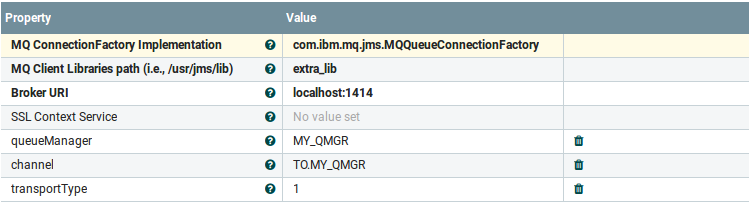
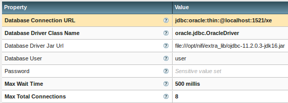

# Nifi docker
Build a nifi docker image on Alpine Linux distro. A sample Nifi flow is included.

## Version
- Nifi: 1.1.0
- IBM MQ client: 7.5.0.2
- Oracle client: 11.2.0.3

>Dockerhub: https://hub.docker.com/r/anoopnair/nifi-alpine/

## Usage
If you want Nifi to connect Elasticsearch, follow the steps
1. Start a elasticsearch docker instance
2. Add "external_links" to the elasticsearch container
3. ``docker-compose up``

- Similarly if you want Nifi to connect to Kafka or Hbase, start the related containers and add the container name to "external_links"
- Remove "external_links" if there are no external container dependencies

Destroy cluster:

- ``docker-compose stop``  OR
- Ctrl C

## Nifi UI
http://localhost:28080/nifi

## Notes
- IBM MQ and Oracle client libraries are copied to /opt/nifi/extra_lib directory on the container. This allows Nifi flows to talk to IBM MQ and Oracle
- /opt/nifi/xsl directory is created to hold XSL documents for transformation. Use "volumes" in docker-compose.yml to mount a host xsl directory to the container /opt/nifi/xsl directory
- Refer elasticsearch-kibana-docker github project (https://github.com/anair-it/elasticsearch-kibana-docker)

## Nifi flow
### UDP log collector
This Nifi flow collects logs on a UDP port from a log4j based application and ship them to elasticsearch

- Start elasticsearch and kibana
- Create a elasticsearch index _applog_. ``curl -XPUT 'http://localhost:9200/applog/'``
- Create kibana index _applog*_ 
- Start Nifi
- Import Nifi template _applog-collector.xml_
- Default UDP port is 9991
- Check the elasticsearch connection info
- Configure log4j to send JSON logs to UDP server in Nifi
- Add following dependencies

		<dependency>
			<groupId>log4j</groupId>
			<artifactId>apache-log4j-extras</artifactId>
			<version>1.2.17</version>
		</dependency>
		<dependency>
			<groupId>net.logstash.log4j</groupId>
			<artifactId>jsonevent-layout</artifactId>
			<version>1.7</version>
		</dependency>

- Add the log4j UDP appender that formats log statements to JSON format:

		<appender name="udp" class="org.apache.log4j.receivers.net.UDPAppender">
		    <param name="RemoteHost" value="{Nifi-hostname}" />
		    <param name="application" value="myapp" />
		    <layout class="net.logstash.log4j.JSONEventLayoutV1"/>
		</appender>

- Identify Nifi hostname using docker inspect and replace {Nifi-hostname} with docker Nifi IP
- Run the application program to spit out log statements
- Check out kibana to see logs

## Controller services for MQ and Oracle
### JMS Connection Factory provider
Here is the screenshot of setting up connection to IBM MQ:

- Use __PublshJMS__ Nifi processor to publish to an IBM MQ Queue
- Use __ConsumeJMS__ Nifi processor to consume from an IBM MQ Queue
- Enter the Queue name and setup the controller service and you are good to go

### DBCP Connection Pool
Here is the screenshot of setting up connection to Oracle DB:

## Reference
- [Apache Nifi](https://nifi.apache.org/)
- [Docker](https://docs.docker.com/)
- [Docker compose](https://docs.docker.com/compose/)
