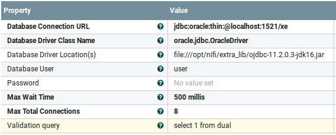

# Nifi docker
Build a nifi docker image on Alpine Linux distro. A sample Nifi flow is included.

## Version
- Nifi: 1.1.2
- IBM MQ client: 7.5.0.2
- Oracle client: 11.2.0.3
- Elasticsearch: 5.2.2
- X pack: 5.0.1

>Dockerhub: https://hub.docker.com/r/anoopnair/nifi-alpine/

## Usage
If you want Nifi to connect Elasticsearch, follow the steps
- ``docker-compose up``

Destroy cluster:

- ``docker-compose stop``  OR
- Ctrl C

## URLs: 
- Nifi: http://localhost:28080/nifi
- Elasticsearch: http://localhost:9200. Login using elastic/changeme
- Kibana: http://localhost:5601. Login using elastic/changeme

## Notes
- Elasticsearch, x-pack transport, IBM MQ and Oracle client libraries are copied to /opt/nifi/extra_lib directory on the container. This allows Nifi flows to talk to Elasticsearch 5, IBM MQ 7.5 and Oracle 11g
- /opt/nifi/xsl directory is created to hold XSL documents for transformation. Use "volumes" in docker-compose.yml to mount a host xsl directory to the container /opt/nifi/xsl directory

## Sample Nifi flow
This flow takes in logs shipped from an application and puts into Elasticsearch. The sequence of setps:

### UDP log collector
This Nifi flow collects logs on a UDP port from a log4j based application and ship them to elasticsearch

- Create a elasticsearch index _applog_. ``curl --user elastic:changeme -XPUT 'http://localhost:9200/applog/'``
- Create kibana index _applog_ 
- Import Nifi template _applog-collector.xml_
- Default UDP port is 9991
- Verify elasticsearch connection info. Use elasticsearch userid/password as _elastic/changeme_
- Identify Nifi hostname using docker inspect
- Configure Apache log4j2 to send JSON logs to UDP server in Nifi. Import log4j2 dependencies.
- Add the log4j2 UDP socket appender that formats log statements to JSON format:

		<Socket name="udp-socket" host="{nifi-host}" port="9991" protocol="UDP">
      			<JSONLayout compact="true"/>
    		</Socket>

- Run the application program to spit out log statements
- Check out kibana to see logs

## Controller services for MQ and Oracle
### JMS Connection Factory provider
Here is the screenshot of setting up connection to IBM MQ:

- Use __PublshJMS__ Nifi processor to publish to an IBM MQ Queue
- Use __ConsumeJMS__ Nifi processor to consume from an IBM MQ Queue
- Enter the Queue name and setup the controller service and you are good to go

### DBCP Connection Pool
Here is the screenshot of setting up connection to Oracle DB:

## Reference
- [Apache Nifi](https://nifi.apache.org/)
- [Docker](https://docs.docker.com/)
- [Docker compose](https://docs.docker.com/compose/)
